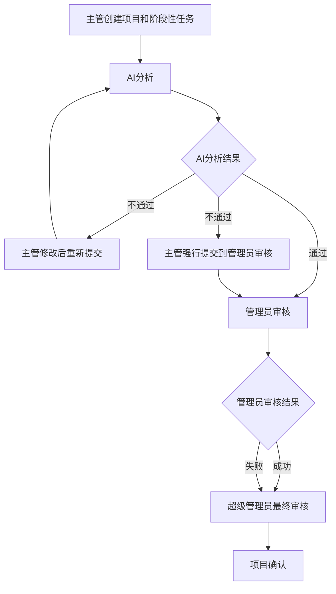
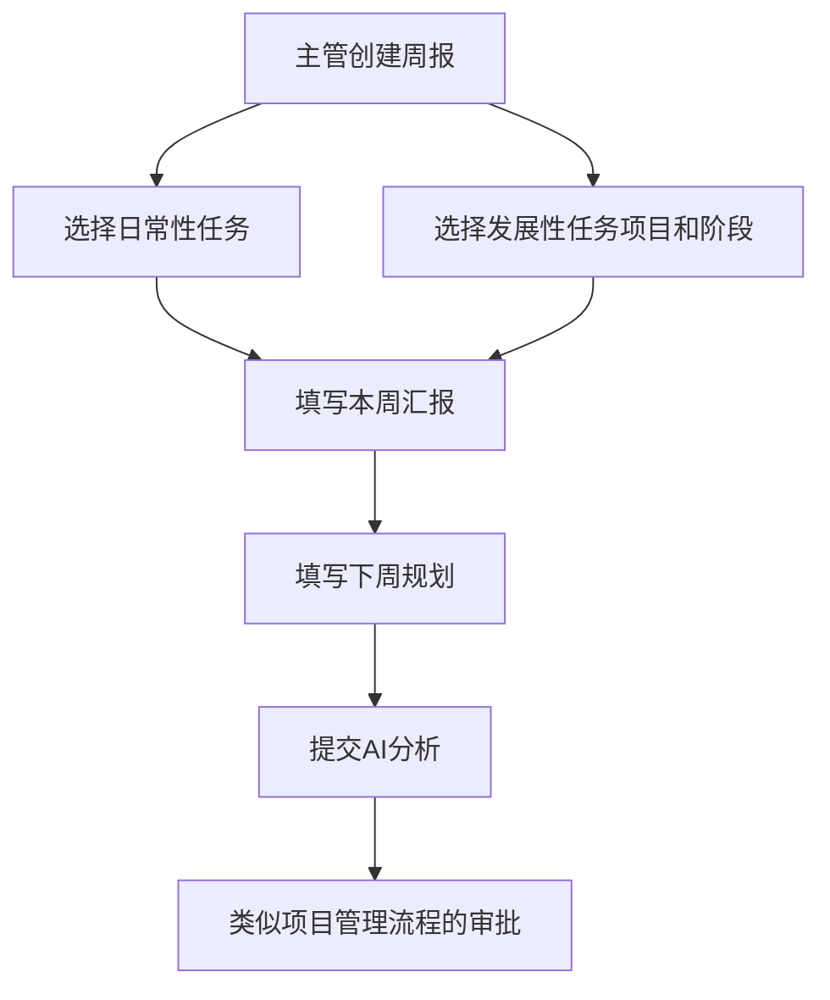

# 后端实现改造分析文档

## 1. 重构后数据库结构分析

### 1.1 数据库表结构（V24重构后）

根据V24__Comprehensive_Database_Restructure.sql重构，最终保留的表结构如下：

```sql
-- 核心业务表
1. users - 用户表（主管、管理员、超级管理员）
2. projects - 项目表（由simple_projects重命名而来）
3. project_phases - 项目阶段表
4. tasks - 任务表（日常性任务）
5. weekly_reports - 周报表（重构为关联表模式）
6. ai_analysis_results - AI分析结果表

-- 关联表（基于error3.md更新的设计）
7. task_reports - 日常性任务与周报关联表
8. dev_task_reports - 发展性项目阶段任务与周报关联表

-- 已删除的表
- departments
- comments  
- simple_weekly_reports
- task_templates
- templates
```

### 1.2 详细表结构设计（基于error3.md补充）

#### 核心表结构
```sql
-- AI分析结果表
ai_analysis_results: {
    id,                    -- 分析结果ID
    report_id,            -- 关联周报ID（可选）
    project_id,           -- 关联项目ID（可选）
    analysis_type,        -- 分析类型
    result,               -- 分析结果JSON
    confidence,           -- 置信度
    status,               -- 分析状态
    created_at,           -- 创建时间
    updated_at            -- 更新时间
}

-- 项目表
projects: {
    id,                   -- 项目ID
    name,                 -- 项目名称
    description,          -- 项目内容
    members,              -- 项目成员
    expected_results,     -- 预期结果
    timeline,             -- 时间线
    stop_loss,            -- 止损点
    ai_analysis_id,       -- AI分析结果ID（外键）
    admin_reviewer_id,    -- 管理员审批人ID
    super_admin_reviewer_id, -- 超级管理员审批人ID
    rejection_reason,     -- 拒绝理由
    approval_status,      -- 审批状态
    created_by,           -- 创建者ID
    created_at,           -- 创建时间
    updated_at            -- 更新时间
}

-- 项目阶段任务表
project_phases: {
    id,                   -- 任务ID
    project_id,           -- 关联项目ID（外键）
    phase_name,           -- 任务名称
    description,          -- 阶段描述
    assigned_members,     -- 负责成员
    schedule,             -- 时间安排
    expected_results,     -- 预期结果
    actual_results,       -- 实际结果
    result_difference_analysis, -- 结果差异分析
    created_at,           -- 创建时间
    updated_at            -- 更新时间
}

-- 日常性任务表
tasks: {
    id,                   -- 任务ID
    task_name,            -- 任务名称
    personnel_assignment, -- 人员分配
    timeline,             -- 时间线
    quantitative_metrics, -- 量化指标
    expected_results,     -- 预期结果
    actual_results,       -- 实际结果
    result_difference_analysis, -- 结果差异分析
    task_type,            -- 任务类型（DAILY/WEEKLY/MONTHLY）
    created_by,           -- 创建者ID
    created_at,           -- 创建时间
    updated_at            -- 更新时间
}

-- 周报表
weekly_reports: {
    id,                   -- 周报ID
    user_id,              -- 提交周报的用户ID
    title,                -- 周报标题
    report_week,          -- 周报日期（中文格式）
    additional_notes,     -- 其他备注
    development_opportunities, -- 可发展性清单
    ai_analysis_id,       -- AI分析结果ID（外键）
    admin_reviewer_id,    -- 管理员审批人ID
    rejection_reason,     -- 拒绝理由
    approval_status,      -- 审批状态
    created_at,           -- 创建时间
    updated_at            -- 更新时间
}
```

#### 关联表结构
```sql
-- 日常性任务与周报关联表（简化设计）
task_reports: {
    weekly_report_id,     -- 周报ID（主键）
    task_id               -- 任务ID（主键）
    -- 注意：actual_results和result_difference_analysis已移回tasks表
}

-- 发展性项目阶段任务与周报关联表（简化设计）
dev_task_reports: {
    weekly_report_id,     -- 周报ID（主键）
    project_id,           -- 项目ID（主键）  
    task_id               -- 阶段任务ID（主键，对应project_phases表的ID）
    -- 注意：actual_results和result_difference_analysis已移回project_phases表
}

-- 周报表（简化后的结构）
weekly_reports: {
    id,                   -- 周报ID
    user_id,              -- 提交周报的用户ID
    title,                -- 周报标题
    additional_notes,     -- 其他备注
    development_opportunities, -- 可发展性清单
    created_at,           -- 创建时间
    updated_at            -- 更新时间
    -- 注意：移除了AI分析和审批相关字段的详细设计
}
```

#### 重要变更说明
1. **实际结果字段位置调整**：
   - `actual_results`和`result_difference_analysis`字段回归到`tasks`和`project_phases`表
   - 关联表只负责建立周报与任务的关系，不存储具体的执行结果

2. **关联表简化**：
   - 移除了`report_section`字段，通过业务逻辑区分本周汇报和下周规划
   - 关联表结构更加简洁，专注于关系映射

3. **审批流程字段暂时简化**：
   - 暂时移除详细的AI分析和审批字段设计
   - 专注于核心的任务关联功能

### 1.3 重构后数据模型特点

1. **关联表设计模式**：
   - 采用关联表而非JSON存储任务引用
   - 支持更灵活的查询和数据一致性

2. **任务分离**：
   - 日常性任务（tasks表）独立存储
   - 发展性任务通过project_phases表管理
   - 通过关联表连接周报和任务

3. **统一审批流程**：
   - 项目和周报都支持AI分析+两级人工审批
   - 标准化的审批状态机设计

4. **数据关联优化**：
   - 减少冗余存储，提高数据一致性
   - 支持复杂的多对多关联关系

## 2. 当前后端实现分析

### 2.1 Entity层现状

**存在问题**：
1. **表映射不匹配**：当前Entity仍映射已删除的表（Department, Comment等）
2. **字段缺失**：Projects和WeeklyReports缺少重构后的审批相关字段
3. **关联关系错误**：Task表的关联关系不符合新的数据库结构

**当前Entity问题列表**：
```java
// 需要删除的Entity
- Department.java (表已删除)
- Comment.java (表已删除)  
- Template.java (表已删除)
- SimpleWeeklyReport.java (表已删除)
- ProjectMember.java (功能已整合)

// 需要重构的Entity
- Project.java (缺少审批字段)
- WeeklyReport.java (结构不匹配)
- Task.java (关联关系错误)
```

### 2.2 Controller层现状

**WeeklyReportController问题**：
1. DTO结构与error3.md中期望的JSON结构不匹配
2. 缺少结构化的任务引用处理逻辑
3. 审批流程API不完整

**ProjectController问题**：
1. 缺少AI分析流程API
2. 审批状态机API不完整
3. 项目阶段管理API分离度不够

### 2.3 Service层现状

**问题分析**：
1. **多版本混乱**：存在WeeklyReportService和WeeklyReportServiceV2
2. **逻辑分散**：AI分析、审批流程逻辑分散在多个服务中
3. **数据转换缺失**：缺少结构化JSON数据处理

## 3. 业务工作流分析（基于CLAUDE.md）

### 3.1 项目管理模块工作流



### 3.2 周报管理模块工作流



### 3.3 数据结构需求（基于error3.md）

**期望的周报提交结构**：
```json
{
  "userid": "",
  "title": "周报标题",
  "reportWeek": "几月第几周（周几）",
  "thisWeekTasks": {
    "routineTasks": [
      {
        "task_id": "日常任务ID",
        "actual_result": "实际结果",
        "result_difference_analysis": "结果差异分析"
      }
    ],
    "developmentalTasks": [
      {
        "project_id": "项目ID",
        "phase_id": "阶段ID",
        "actual_result": "实际结果",
        "result_difference_analysis": "结果差异分析"
      }
    ]
  },
  "nextWeekPlan": {
    "routineTasks": [{"task_id": "日常任务ID"}],
    "developmentalTasks": [{"project_id": "项目ID", "phase_id": "阶段ID"}]
  },
  "additionalNotes": "其他备注",
  "developmentOpportunities": "可发展性清单"
}
```

**数据存储策略**：
- 基础信息存储在weekly_reports表
- 日常任务关联存储在task_reports表
- 发展性任务关联存储在dev_task_reports表
- 支持本周汇报和下周规划的分别存储

## 4. 差异对比分析

### 4.1 数据库vs实体映射差异

| 数据库表 | 当前Entity | 状态 | 问题描述 |
|---------|-----------|------|---------|
| projects | Project.java | ❌ 不匹配 | 缺少AI分析和审批字段 |
| weekly_reports | WeeklyReport.java | ❌ 不匹配 | content字段应为JSON，缺少nextWeekPlan |
| tasks | Task.java | ❌ 部分匹配 | 关联关系需要调整 |
| ai_analysis_results | AIAnalysisResult.java | ✅ 匹配 | 基本匹配 |
| project_phases | ProjectPhase.java | ✅ 匹配 | 基本匹配 |
| users | User.java | ✅ 匹配 | 基本匹配 |

### 4.2 API接口vs业务需求差异

| 功能模块 | 当前实现 | 需求 | 差异描述 |
|---------|---------|------|---------|
| 周报创建 | 基于旧DTO结构 | JSON结构化任务引用 | 完全不匹配 |
| 项目审批 | 部分实现 | 完整三级审批流程 | 功能不完整 |
| AI分析 | 分散实现 | 统一AI分析服务 | 架构需重构 |
| 任务管理 | 多表设计 | 单表统一管理 | 需要合并逻辑 |

### 4.3 工作流实现差异

**当前实现缺陷**：
1. **状态机不完整**：缺少完整的审批状态转换逻辑
2. **角色权限模糊**：主管、管理员、超级管理员权限边界不清
3. **数据一致性问题**：多服务版本导致数据处理不一致

## 5. 后端改造方案

### 5.1 Entity层改造

#### 5.1.1 需要删除的Entity
```java
// 删除这些不再需要的Entity
- Department.java
- Comment.java
- Template.java  
- SimpleWeeklyReport.java
- ProjectMember.java
- RoutineTask.java (功能合并到Task)
- WeeklyReportV2.java (统一到WeeklyReport)
```

#### 5.1.2 需要新增的Entity
```java
// 新增关联表Entity（简化设计）
@Entity
@Table(name = "task_reports")
public class TaskReport {
    @EmbeddedId
    private TaskReportId id;
    
    // 简化：移除report_section和result字段
    // 这些信息通过业务逻辑和tasks表本身来管理
    
    // 可选：添加关联时间戳
    @CreationTimestamp
    @Column(name = "created_at")
    private LocalDateTime createdAt;
}

@Embeddable
public class TaskReportId implements Serializable {
    @Column(name = "weekly_report_id")
    private Long weeklyReportId;
    
    @Column(name = "task_id")
    private Long taskId;
    
    // 构造函数、equals、hashCode方法
}

@Entity
@Table(name = "dev_task_reports") 
public class DevTaskReport {
    @EmbeddedId
    private DevTaskReportId id;
    
    // 简化：移除report_section和result字段
    
    @CreationTimestamp
    @Column(name = "created_at")
    private LocalDateTime createdAt;
}

@Embeddable
public class DevTaskReportId implements Serializable {
    @Column(name = "weekly_report_id")
    private Long weeklyReportId;
    
    @Column(name = "project_id")
    private Long projectId;
    
    @Column(name = "task_id")  // 对应project_phases表的ID
    private Long taskId;
    
    // 构造函数、equals、hashCode方法
}
```

#### 5.1.3 需要重构的Entity

**Project.java改造**：
```java
// 添加审批流程字段
@Column(name = "ai_analysis_id")
private Long aiAnalysisId;

@Column(name = "admin_reviewer_id") 
private Long adminReviewerId;

@Column(name = "super_admin_reviewer_id")
private Long superAdminReviewerId;

@Column(name = "rejection_reason")
private String rejectionReason;

@Enumerated(EnumType.STRING)
@Column(name = "approval_status")
private ApprovalStatus approvalStatus = ApprovalStatus.DRAFT;

// 审批状态枚举
public enum ApprovalStatus {
    DRAFT, AI_ANALYZING, AI_APPROVED, AI_REJECTED,
    ADMIN_REVIEWING, ADMIN_APPROVED, ADMIN_REJECTED,
    SUPER_ADMIN_REVIEWING, SUPER_ADMIN_APPROVED, 
    SUPER_ADMIN_REJECTED, FINAL_APPROVED
}
```

**WeeklyReport.java改造**：
```java
// 简化为基础字段设计（按照error3.md最新结构）
@Id
@GeneratedValue(strategy = GenerationType.IDENTITY)
private Long id;

@NotNull
@Column(name = "user_id")
private Long userId; // 提交周报的用户ID

@NotBlank
@Column(name = "title")
private String title; // 周报标题

@Column(name = "additional_notes", columnDefinition = "TEXT")
private String additionalNotes; // 其他备注

@Column(name = "development_opportunities", columnDefinition = "TEXT")
private String developmentOpportunities; // 可发展性清单

@CreationTimestamp
@Column(name = "created_at")
private LocalDateTime createdAt;

@UpdateTimestamp
@Column(name = "updated_at")
private LocalDateTime updatedAt;

// 用户关联
@ManyToOne(fetch = FetchType.LAZY)
@JoinColumn(name = "user_id", insertable = false, updatable = false)
private User user;

// 关联关系（基于关联表）
@OneToMany(cascade = CascadeType.ALL, orphanRemoval = true)
@JoinColumn(name = "weekly_report_id")
private Set<TaskReport> taskReports = new HashSet<>();

@OneToMany(cascade = CascadeType.ALL, orphanRemoval = true)
@JoinColumn(name = "weekly_report_id")
private Set<DevTaskReport> devTaskReports = new HashSet<>();

// 业务方法
public void addTaskReport(Long taskId) {
    TaskReport taskReport = new TaskReport();
    taskReport.setId(new TaskReportId(this.id, taskId));
    this.taskReports.add(taskReport);
}

public void addDevTaskReport(Long projectId, Long taskId) {
    DevTaskReport devTaskReport = new DevTaskReport();
    devTaskReport.setId(new DevTaskReportId(this.id, projectId, taskId));
    this.devTaskReports.add(devTaskReport);
}
```

**Task.java改造**：
```java
// 简化为仅存储日常性任务
// 移除project相关字段
// 保留核心任务信息
@Column(name = "task_name")
private String taskName;

@Column(name = "personnel_assignment")
private String personnelAssignment;

@Column(name = "timeline")
private String timeline;

@Column(name = "quantitative_metrics")
private String quantitativeMetrics;

@Column(name = "expected_results")
private String expectedResults;

// 移除actual_results和result_difference_analysis
// 这些字段移到TaskReport关联表中

@Enumerated(EnumType.STRING)
@Column(name = "task_type")
private TaskType taskType;

public enum TaskType {
    DAILY,      // 每日任务
    WEEKLY,     // 每周任务  
    MONTHLY     // 每月任务
}

// 添加创建者关联
@ManyToOne(fetch = FetchType.LAZY)
@JoinColumn(name = "created_by")
private User createdBy;
```

### 5.2 DTO层改造

#### 5.2.1 新的周报创建DTO（简化设计）
```java
public class WeeklyReportCreateRequestV2 {
    @NotNull
    private Long userId; // 提交周报的用户ID
    
    @NotBlank
    private String title; // 周报标题
    
    @Valid
    private List<Long> taskIds; // 关联的日常任务ID列表
    
    @Valid
    private List<DevTaskReportRequest> devTasks; // 关联的发展性任务列表
    
    private String additionalNotes; // 其他备注
    private String developmentOpportunities; // 可发展性清单
}

// 发展性任务关联请求
public class DevTaskReportRequest {
    @NotNull
    private Long projectId; // 项目ID
    
    @NotNull
    private Long taskId; // 阶段任务ID（对应project_phases表）
}

// 周报响应DTO
public class WeeklyReportResponse {
    private Long id;
    private Long userId;
    private String title;
    private String additionalNotes;
    private String developmentOpportunities;
    private LocalDateTime createdAt;
    private LocalDateTime updatedAt;
    
    // 关联的任务信息
    private List<TaskSummary> tasks;
    private List<DevTaskSummary> devTasks;
}

public class TaskSummary {
    private Long taskId;
    private String taskName;
    private String actualResults; // 从tasks表获取
    private String resultDifferenceAnalysis; // 从tasks表获取
}

public class DevTaskSummary {
    private Long projectId;
    private String projectName;
    private Long taskId;
    private String taskName;
    private String actualResults; // 从project_phases表获取
    private String resultDifferenceAnalysis; // 从project_phases表获取
}
```

### 5.3 Service层改造

#### 5.3.1 统一周报服务（简化设计）
```java
@Service
@Transactional
public class WeeklyReportService {
    
    @Autowired
    private WeeklyReportRepository weeklyReportRepository;
    
    @Autowired
    private TaskReportRepository taskReportRepository;
    
    @Autowired
    private DevTaskReportRepository devTaskReportRepository;
    
    @Autowired
    private TaskRepository taskRepository;
    
    @Autowired
    private ProjectPhaseRepository projectPhaseRepository;
    
    @Autowired
    private ProjectRepository projectRepository;
    
    public WeeklyReportResponse createWeeklyReport(WeeklyReportCreateRequestV2 request) {
        // 1. 创建周报基础信息
        WeeklyReport report = new WeeklyReport();
        report.setUserId(request.getUserId());
        report.setTitle(request.getTitle());
        report.setAdditionalNotes(request.getAdditionalNotes());
        report.setDevelopmentOpportunities(request.getDevelopmentOpportunities());
        
        WeeklyReport savedReport = weeklyReportRepository.save(report);
        
        // 2. 建立日常任务关联
        createTaskReports(savedReport.getId(), request.getTaskIds());
        
        // 3. 建立发展性任务关联
        createDevTaskReports(savedReport.getId(), request.getDevTasks());
        
        return buildWeeklyReportResponse(savedReport);
    }
    
    private void createTaskReports(Long reportId, List<Long> taskIds) {
        if (taskIds != null && !taskIds.isEmpty()) {
            for (Long taskId : taskIds) {
                TaskReport taskReport = new TaskReport();
                taskReport.setId(new TaskReportId(reportId, taskId));
                taskReportRepository.save(taskReport);
            }
        }
    }
    
    private void createDevTaskReports(Long reportId, List<DevTaskReportRequest> devTasks) {
        if (devTasks != null && !devTasks.isEmpty()) {
            for (DevTaskReportRequest devTask : devTasks) {
                DevTaskReport devTaskReport = new DevTaskReport();
                devTaskReport.setId(new DevTaskReportId(reportId, 
                    devTask.getProjectId(), devTask.getTaskId()));
                devTaskReportRepository.save(devTaskReport);
            }
        }
    }
    
    public WeeklyReportResponse getWeeklyReport(Long reportId) {
        WeeklyReport report = weeklyReportRepository.findById(reportId)
            .orElseThrow(() -> new RuntimeException("Weekly report not found"));
        
        return buildWeeklyReportResponse(report);
    }
    
    private WeeklyReportResponse buildWeeklyReportResponse(WeeklyReport report) {
        WeeklyReportResponse response = new WeeklyReportResponse();
        response.setId(report.getId());
        response.setUserId(report.getUserId());
        response.setTitle(report.getTitle());
        response.setAdditionalNotes(report.getAdditionalNotes());
        response.setDevelopmentOpportunities(report.getDevelopmentOpportunities());
        response.setCreatedAt(report.getCreatedAt());
        response.setUpdatedAt(report.getUpdatedAt());
        
        // 构建关联的任务信息
        List<TaskSummary> tasks = buildTaskSummaries(report.getId());
        List<DevTaskSummary> devTasks = buildDevTaskSummaries(report.getId());
        
        response.setTasks(tasks);
        response.setDevTasks(devTasks);
        
        return response;
    }
    
    private List<TaskSummary> buildTaskSummaries(Long reportId) {
        List<TaskReport> taskReports = taskReportRepository.findByIdWeeklyReportId(reportId);
        return taskReports.stream().map(tr -> {
            Task task = taskRepository.findById(tr.getId().getTaskId()).orElse(null);
            if (task != null) {
                TaskSummary summary = new TaskSummary();
                summary.setTaskId(task.getId());
                summary.setTaskName(task.getTaskName());
                summary.setActualResults(task.getActualResults());
                summary.setResultDifferenceAnalysis(task.getResultDifferenceAnalysis());
                return summary;
            }
            return null;
        }).filter(Objects::nonNull).collect(Collectors.toList());
    }
    
    private List<DevTaskSummary> buildDevTaskSummaries(Long reportId) {
        List<DevTaskReport> devTaskReports = devTaskReportRepository.findByIdWeeklyReportId(reportId);
        return devTaskReports.stream().map(dtr -> {
            ProjectPhase phase = projectPhaseRepository.findById(dtr.getId().getTaskId()).orElse(null);
            Project project = projectRepository.findById(dtr.getId().getProjectId()).orElse(null);
            
            if (phase != null && project != null) {
                DevTaskSummary summary = new DevTaskSummary();
                summary.setProjectId(project.getId());
                summary.setProjectName(project.getName());
                summary.setTaskId(phase.getId());
                summary.setTaskName(phase.getPhaseName());
                summary.setActualResults(phase.getActualResults());
                summary.setResultDifferenceAnalysis(phase.getResultDifferenceAnalysis());
                return summary;
            }
            return null;
        }).filter(Objects::nonNull).collect(Collectors.toList());
    }
}
```

#### 5.3.2 审批流程服务
```java
@Service
public class ApprovalWorkflowService {
    // 统一项目和周报的审批流程
    // 实现状态机模式
    // 集成AI分析服务
}
```

#### 5.3.3 AI分析服务重构
```java
@Service
public class AIAnalysisService {
    // 统一AI分析接口
    // 支持项目和周报分析
    // 标准化分析结果格式
}
```

### 5.4 Controller层改造

#### 5.4.1 周报控制器重构
```java
@RestController
@RequestMapping("/api/weekly-reports")
public class WeeklyReportController {
    
    // 使用新的DTO结构
    @PostMapping
    public ResponseEntity<ApiResponse<WeeklyReportResponse>> createWeeklyReport(
        @Valid @RequestBody WeeklyReportCreateRequestV2 request
    );
    
    // 审批相关API
    @PostMapping("/{id}/submit")
    public ResponseEntity<ApiResponse<Void>> submitReport(@PathVariable Long id);
    
    @PostMapping("/{id}/approve")
    public ResponseEntity<ApiResponse<Void>> approveReport(
        @PathVariable Long id, @RequestBody ApprovalRequest request
    );
    
    @PostMapping("/{id}/reject") 
    public ResponseEntity<ApiResponse<Void>> rejectReport(
        @PathVariable Long id, @RequestBody RejectionRequest request
    );
}
```

#### 5.4.2 项目控制器增强
```java
@RestController
@RequestMapping("/api/projects")
public class ProjectController {
    
    // 添加审批流程API
    @PostMapping("/{id}/submit")
    public ResponseEntity<ApiResponse<Void>> submitProject(@PathVariable Long id);
    
    @PostMapping("/{id}/ai-analyze")
    public ResponseEntity<ApiResponse<AIAnalysisResult>> analyzeProject(@PathVariable Long id);
    
    // 完整的审批API
    @PostMapping("/{id}/admin-review")
    public ResponseEntity<ApiResponse<Void>> adminReview(
        @PathVariable Long id, @RequestBody ReviewRequest request
    );
    
    @PostMapping("/{id}/super-admin-review")
    public ResponseEntity<ApiResponse<Void>> superAdminReview(
        @PathVariable Long id, @RequestBody ReviewRequest request
    );
}
```

## 6. 实施优先级和风险评估

### 6.1 改造优先级

**第一阶段（高优先级）**：
1. Entity层改造 - 关键基础设施
2. 周报DTO结构重构 - 直接影响前端集成
3. 基础CRUD服务修复

**第二阶段（中优先级）**：
1. 审批流程API实现
2. AI分析服务重构
3. 数据迁移脚本

**第三阶段（低优先级）**：
1. 性能优化
2. 监控和日志增强
3. 文档完善

### 6.2 风险评估

**高风险**：
- 数据库表结构已改变，Entity不匹配可能导致运行时错误
- 现有API客户端可能因DTO结构变化而失败

**中风险**：
- 审批流程状态机复杂，容易出现逻辑错误
- AI分析服务集成可能有性能问题

**低风险**：
- 前端适配问题（可通过版本控制解决）
- 测试数据迁移问题

### 6.3 建议实施步骤

1. **准备阶段**：
   - 备份当前数据库
   - 创建开发分支
   - 准备测试环境

2. **Entity改造**：
   - 删除废弃Entity
   - 重构核心Entity
   - 更新Repository层

3. **DTO重构**：
   - 实现新的周报DTO结构
   - 保持向后兼容的API版本

4. **服务重构**：
   - 统一服务接口
   - 实现审批流程
   - 集成AI分析

5. **测试验证**：
   - 单元测试覆盖
   - 集成测试验证
   - 前端联调测试

6. **部署上线**：
   - 灰度发布
   - 监控数据
   - 回滚准备

## 7. 基于关联表设计的改造重点

根据error3.md更新的需求，改造重点已从JSON存储模式调整为关联表模式：

### 7.1 核心改造内容

1. **数据存储模式转变**：
   - 从JSON字段存储任务引用 → 关联表存储
   - 支持更灵活的查询和数据一致性保证
   - 便于后续扩展和维护

2. **新增关联表Entity**：
   - TaskReport - 日常任务与周报关联
   - DevTaskReport - 发展性任务与周报关联
   - 支持本周汇报和下周规划的区分存储

3. **Repository层新增**：
   - TaskReportRepository
   - DevTaskReportRepository
   - 支持复合主键查询

### 7.2 数据流程优化

**周报创建流程**：
1. 创建WeeklyReport基础记录
2. 批量创建TaskReport关联记录
3. 批量创建DevTaskReport关联记录
4. 触发AI分析流程

**数据查询优化**：
- 通过JOIN查询获取完整周报数据
- 支持按报告部分（本周/下周）筛选
- 优化复合主键查询性能

### 7.3 前后端接口适配

**前端需要适配的接口变更**：
1. 周报创建接口DTO结构完全变更
2. 周报查询接口返回格式调整
3. 任务关联的查询接口新增

**向后兼容策略**：
- 保留原API版本一段时间
- 提供数据迁移接口
- 渐进式切换到新接口

## 8. 基于最新error3.md的改造总结

### 8.1 主要变更点

根据error3.md的最新更新，改造方案已简化为：

1. **关联表纯关系映射**：
   - TaskReport和DevTaskReport只存储关联关系
   - 实际结果和差异分析字段回归到原始表（tasks、project_phases）

2. **WeeklyReport表简化**：
   - 移除复杂的审批流程字段设计
   - 专注于核心的周报基础信息存储

3. **数据查询优化**：
   - 通过JOIN查询获取完整信息
   - 减少数据冗余，提高一致性

### 8.2 当前后端与新设计的差异

1. **Entity映射错误** - 多个Entity映射已删除的表
2. **关联表缺失** - 缺少TaskReport和DevTaskReport实现
3. **数据结构不匹配** - WeeklyReport字段设计复杂度过高
4. **查询逻辑需重构** - 需要支持JOIN查询模式
5. **服务架构混乱** - 多版本共存，逻辑分散

### 8.3 实施优先级调整

**第一阶段（最高优先级）**：
1. 创建TaskReport和DevTaskReport关联表Entity
2. 简化WeeklyReport Entity设计
3. 实现基础的关联表Repository

**第二阶段（高优先级）**：
1. 重构WeeklyReportService使用关联表模式
2. 调整DTO结构适配简化设计
3. 实现JOIN查询逻辑

**第三阶段（中优先级）**：
1. 适配前端接口调用
2. 数据迁移和清理
3. 性能调优和索引优化

**第四阶段（低优先级）**：
1. 完善审批流程（如果需要）
2. 监控和日志增强
3. 文档更新

### 8.4 风险评估更新

**降低的风险**：
- 简化设计降低了实现复杂度
- 关联表模式更加标准，维护性更好

**新增的风险**：
- JOIN查询可能影响性能，需要合理设计索引
- 前端需要适配新的数据结构

**预计时间**：
整个改造过程预计需要2-3周时间（比之前估计减少），关键在于关联表的正确实现和查询逻辑的优化。

### 8.5 核心改造检查清单

- [ ] 删除废弃Entity（Department、Comment等）
- [ ] 创建TaskReport和DevTaskReport Entity
- [ ] 简化WeeklyReport Entity设计
- [ ] 实现关联表Repository接口
- [ ] 重构WeeklyReportService服务
- [ ] 调整DTO结构和接口
- [ ] 实现JOIN查询逻辑
- [ ] 前端接口适配
- [ ] 数据迁移脚本
- [ ] 性能测试和优化