# 周报系统数据库设计文档

## 概述

本文档描述了周报系统的数据库结构，包含每个表的作用、字段说明和关系图。系统采用MySQL数据库，使用JPA/Hibernate作为ORM框架。

## 核心表结构

### 1. 用户表 (users)

**作用**: 存储系统用户信息，支持三级权限体系

**字段说明**:
- `id` (BIGINT): 主键，自增
- `username` (VARCHAR(50)): 用户名，唯一
- `email` (VARCHAR(100)): 邮箱地址，唯一  
- `password` (VARCHAR(255)): 密码哈希值
- `full_name` (VARCHAR(100)): 用户全名
- `employee_id` (VARCHAR(20)): 员工编号，唯一
- `phone` (VARCHAR(20)): 电话号码
- `position` (VARCHAR(100)): 职位
- `role` (ENUM): 角色 - SUPER_ADMIN(超级管理员), ADMIN(管理员), MANAGER(主管)
- `status` (ENUM): 状态 - ACTIVE, INACTIVE, LOCKED, DELETED
- `avatar_url` (VARCHAR): 头像URL
- `last_login_time` (TIMESTAMP): 最后登录时间
- `department_id` (BIGINT): 所属部门ID，外键
- `created_at`, `updated_at` (TIMESTAMP): 创建和更新时间

**关系**:
- 多对一关联部门 (departments)
- 一对多关联周报 (weekly_reports)
- 一对多关联评论 (comments)
- 一对多关联项目 (projects)

### 2. 部门表 (departments)

**作用**: 存储组织架构信息，支持层级结构

**字段说明**:
- `id` (BIGINT): 主键，自增
- `name` (VARCHAR(100)): 部门名称
- `code` (VARCHAR(20)): 部门编码，唯一
- `description` (VARCHAR(500)): 部门描述
- `level` (INT): 部门层级
- `path` (VARCHAR(1000)): 层级路径
- `sort_order` (INT): 排序号
- `status` (ENUM): 状态 - ACTIVE, INACTIVE, MERGED, DISSOLVED
- `manager_name` (VARCHAR(100)): 部门经理姓名
- `contact_email` (VARCHAR(100)): 联系邮箱
- `contact_phone` (VARCHAR(20)): 联系电话
- `parent_id` (BIGINT): 父部门ID，外键
- `created_at`, `updated_at` (TIMESTAMP): 创建和更新时间

**关系**:
- 自关联：多对一父部门，一对多子部门
- 一对多关联用户 (users)
- 一对多关联模板 (templates)

### 3. 周报表 (weekly_reports)

**作用**: 存储用户提交的周报内容和审批状态

**字段说明**:
- `id` (BIGINT): 主键，自增
- `title` (VARCHAR(200)): 周报标题
- `report_week` (DATE): 周报所属周的开始日期
- `year` (INT): 年份
- `week_number` (INT): 周数
- `content` (TEXT): 周报内容
- `work_summary` (TEXT): 工作总结
- `achievements` (TEXT): 主要成果
- `challenges` (TEXT): 遇到的挑战
- `next_week_plan` (TEXT): 下周计划
- `additional_notes` (TEXT): 其他备注
- `status` (ENUM): 状态 - DRAFT, SUBMITTED, AI_ANALYZING, PENDING_ADMIN_REVIEW, ADMIN_REJECTED, PENDING_SUPER_ADMIN_REVIEW, SUPER_ADMIN_REJECTED, APPROVED, PUBLISHED
- `submitted_at` (TIMESTAMP): 提交时间
- `reviewed_at` (TIMESTAMP): 审核时间
- `review_comment` (TEXT): 审核意见
- `is_late` (BOOLEAN): 是否迟交
- `word_count` (INT): 字数统计
- `priority` (INT): 优先级 1-10
- `author_id` (BIGINT): 作者ID，外键
- `template_id` (BIGINT): 使用的模板ID，外键
- `reviewer_id` (BIGINT): 审核人ID，外键
- AI分析字段：
  - `ai_analysis_result` (TEXT): AI分析结果
  - `ai_confidence` (DECIMAL): AI信心度
  - `ai_quality_score` (DECIMAL): AI质量评分
  - `ai_risk_level` (VARCHAR): 风险等级
  - `ai_provider_used` (VARCHAR): AI服务提供商
  - `ai_processing_time_ms` (BIGINT): 处理时间
  - `ai_analyzed_at` (TIMESTAMP): 分析时间
  - `ai_key_issues` (JSON): 关键问题
  - `ai_recommendations` (JSON): 改进建议
- 三级审批字段：
  - `manager_reviewer_id`, `admin_reviewer_id`, `super_admin_reviewer_id`: 各级审核人
  - 对应的 `*_review_comment`, `*_reviewed_at`: 审核意见和时间
- `created_at`, `updated_at` (TIMESTAMP): 创建和更新时间

**关系**:
- 多对一关联作者 (users)
- 多对一关联模板 (templates)
- 多对一关联审核人 (users)
- 一对多关联任务 (tasks)
- 一对多关联评论 (comments)
- 一对多关联AI分析结果 (ai_analysis_results)

### 4. 任务表 (tasks)

**作用**: 存储周报中的具体任务信息，分为日常性和发展性任务

**字段说明**:
- `id` (BIGINT): 主键，自增
- `task_name` (VARCHAR(200)): 任务名称
- `task_type` (ENUM): 任务类型 - ROUTINE(日常性), DEVELOPMENT(发展性)
- `report_section` (ENUM): 报告区域 - THIS_WEEK_REPORT, NEXT_WEEK_PLAN
- `personnel_assignment` (VARCHAR(100)): 人员分配
- `timeline` (VARCHAR(200)): 时间线
- `quantitative_metrics` (VARCHAR(300)): 量化指标
- `expected_results` (VARCHAR(500)): 预估结果
- `actual_results` (VARCHAR(500)): 实际结果
- `result_difference_analysis` (TEXT): 结果差异分析
- `stop_loss_point` (VARCHAR(500)): 止损点
- `progress` (INT): 完成度 0-100
- `start_date`, `due_date`, `completion_date` (DATE): 开始、截止、完成日期
- `budget` (DECIMAL): 预算
- `is_completed` (BOOLEAN): 是否完成
- `is_overdue` (BOOLEAN): 是否逾期
- `priority` (INT): 优先级 1-10
- `weekly_report_id` (BIGINT): 关联周报ID，外键，可为空
- `simple_project_id` (BIGINT): 关联简化项目ID，外键
- `project_phase_id` (BIGINT): 关联项目阶段ID，外键
- `created_at`, `updated_at` (TIMESTAMP): 创建和更新时间

**关系**:
- 多对一关联周报 (weekly_reports)，可为空
- 多对一关联简化项目 (simple_projects)
- 多对一关联项目阶段 (project_phases)

### 5. 项目表 (projects)

**作用**: 存储项目基本信息（原始复杂版本，现已简化）

**字段说明**:
- `id` (BIGINT): 主键，自增
- `name` (VARCHAR(100)): 项目名称
- `description` (TEXT): 项目描述
- `status` (ENUM): 状态 - PLANNING, ACTIVE, ON_HOLD, COMPLETED, CANCELLED
- `priority` (ENUM): 优先级 - LOW, MEDIUM, HIGH, URGENT
- `start_date`, `end_date` (DATE): 开始和结束日期
- `budget` (DECIMAL): 预算
- `progress` (INT): 进度 0-100
- `tags` (VARCHAR(200)): 标签
- `is_public` (BOOLEAN): 是否公开
- `archived` (BOOLEAN): 是否归档
- `created_by` (BIGINT): 创建者ID，外键
- `department_id` (BIGINT): 所属部门ID，外键
- `created_at`, `updated_at` (TIMESTAMP): 创建和更新时间
- `deleted_at` (TIMESTAMP): 软删除时间

**关系**:
- 多对一关联创建者 (users)
- 多对一关联部门 (departments)
- 一对多关联周报 (weekly_reports)，通过中间表

### 6. 简化项目表 (simple_projects)

**作用**: 存储核心业务项目信息，支持AI分析和三级审批

**字段说明**:
- `id` (BIGINT): 主键，自增
- `project_name` (VARCHAR): 项目名称
- `project_content` (TEXT): 项目内容
- `project_members` (TEXT): 项目成员
- `expected_results` (TEXT): 预期结果（量化指标形式）
- `actual_results` (TEXT): 实际结果
- `timeline` (TEXT): 时间线
- `stop_loss` (TEXT): 止损点
- `status` (ENUM): 状态 - SUBMITTED, PENDING_MANAGER_REVIEW, MANAGER_REJECTED, PENDING_AI_ANALYSIS, AI_REJECTED, PENDING_ADMIN_REVIEW, ADMIN_REJECTED, PENDING_SUPER_ADMIN_REVIEW, SUPER_ADMIN_REJECTED, APPROVED
- AI分析字段：
  - `ai_analysis_result` (TEXT): AI分析结果
  - `ai_confidence` (DECIMAL): AI信心度
  - `ai_feasibility_score` (DECIMAL): 可行性评分
  - `ai_risk_level` (VARCHAR): 风险等级
  - `ai_provider_used` (VARCHAR): AI服务商
  - `ai_processing_time_ms` (BIGINT): 处理时间
  - `ai_analyzed_at` (TIMESTAMP): 分析时间
  - `ai_key_issues` (JSON): 关键问题
  - `ai_recommendations` (JSON): 建议
- 三级审批字段：
  - `manager_reviewer_id`, `admin_reviewer_id`, `super_admin_reviewer_id`: 各级审核人
  - 对应的 `*_review_comment`, `*_reviewed_at`: 审核意见和时间
- `created_by` (BIGINT): 创建者ID，外键
- `created_at`, `updated_at` (TIMESTAMP): 创建和更新时间

**关系**:
- 多对一关联创建者 (users)
- 多对一关联各级审核人 (users)
- 一对多关联简化周报 (simple_weekly_reports)
- 一对多关联项目阶段 (project_phases)

### 7. 简化周报表 (simple_weekly_reports)

**作用**: 存储项目相关的简化周报信息

**字段说明**:
- `id` (BIGINT): 主键，自增
- `project_id` (BIGINT): 关联项目ID，外键
- `actual_results` (TEXT): 实际结果
- `created_by` (BIGINT): 创建者ID，外键
- `created_at` (TIMESTAMP): 创建时间

**关系**:
- 多对一关联简化项目 (simple_projects)
- 多对一关联创建者 (users)

### 8. 项目阶段表 (project_phases)

**作用**: 存储项目的不同阶段信息

**字段说明**:
- `id` (BIGINT): 主键，自增
- `project_id` (BIGINT): 关联项目ID，外键
- `phase_name` (VARCHAR): 阶段名称
- `phase_description` (TEXT): 阶段描述
- `planned_start_date`, `planned_end_date` (DATE): 计划开始和结束日期
- `actual_start_date`, `actual_end_date` (DATE): 实际开始和结束日期
- `status` (ENUM): 状态 - PLANNED, IN_PROGRESS, COMPLETED, CANCELLED, ON_HOLD
- `progress` (INT): 进度 0-100
- `milestone` (BOOLEAN): 是否为里程碑
- `deliverables` (TEXT): 交付成果
- `dependencies` (TEXT): 依赖关系
- `created_at`, `updated_at` (TIMESTAMP): 创建和更新时间

**关系**:
- 多对一关联简化项目 (simple_projects)
- 一对多关联任务 (tasks)

### 9. 模板表 (templates)

**作用**: 存储周报模板配置

**字段说明**:
- `id` (BIGINT): 主键，自增
- `name` (VARCHAR(100)): 模板名称
- `description` (VARCHAR(500)): 模板描述
- `type` (ENUM): 类型 - SYSTEM, DEPARTMENT, PERSONAL
- `status` (ENUM): 状态 - ACTIVE, INACTIVE, DEPRECATED, DRAFT
- `content` (JSON): 模板内容配置
- `default_title` (VARCHAR(200)): 默认标题模板
- `version` (INT): 版本号
- `sort_order` (INT): 排序
- `is_default` (BOOLEAN): 是否默认
- `is_required` (BOOLEAN): 是否必填
- `usage_count` (INT): 使用次数
- `department_id` (BIGINT): 适用部门ID，外键
- `created_by` (BIGINT): 创建者ID，外键
- `created_at`, `updated_at` (TIMESTAMP): 创建和更新时间

**关系**:
- 多对一关联部门 (departments)
- 多对一关联创建者 (users)
- 一对多关联周报 (weekly_reports)

### 10. 评论表 (comments)

**作用**: 存储对周报的评论和反馈

**字段说明**:
- `id` (BIGINT): 主键，自增
- `content` (TEXT): 评论内容
- `type` (ENUM): 类型 - GENERAL, SUGGESTION, QUESTION, APPROVAL, REJECTION, REVISION, PRAISE, CONCERN, REMINDER
- `status` (ENUM): 状态 - ACTIVE, HIDDEN, DELETED, FLAGGED
- `priority` (INT): 优先级 1-5
- `is_resolved` (BOOLEAN): 是否已解决
- `resolved_at` (TIMESTAMP): 解决时间
- `tags` (VARCHAR(200)): 标签
- `likes_count` (INT): 点赞数
- `is_private` (BOOLEAN): 是否私密
- `attachments` (JSON): 附件信息
- `weekly_report_id` (BIGINT): 关联周报ID，外键
- `author_id` (BIGINT): 作者ID，外键
- `parent_id` (BIGINT): 父评论ID，外键（支持回复）
- `resolved_by` (BIGINT): 解决人ID，外键
- `created_at`, `updated_at` (TIMESTAMP): 创建和更新时间

**关系**:
- 多对一关联周报 (weekly_reports)
- 多对一关联作者 (users)
- 自关联：多对一父评论，一对多回复评论
- 多对一关联解决人 (users)

### 11. AI分析结果表 (ai_analysis_results)

**作用**: 存储AI分析的详细结果

**字段说明**:
- `id` (BIGINT): 主键，自增
- `analysis_type` (ENUM): 分析类型
- `analysis_result` (TEXT): 分析结果
- `confidence_score` (DECIMAL): 信心度评分
- `quality_metrics` (JSON): 质量指标
- `recommendations` (JSON): 改进建议
- `risk_assessment` (JSON): 风险评估
- `provider_used` (VARCHAR): AI服务商
- `model_version` (VARCHAR): 模型版本
- `processing_time_ms` (BIGINT): 处理时间
- `weekly_report_id` (BIGINT): 关联周报ID，外键
- `created_at` (TIMESTAMP): 创建时间

**关系**:
- 多对一关联周报 (weekly_reports)

## ER图

```mermaid
erDiagram
    users {
        BIGINT id PK
        VARCHAR username UK
        VARCHAR email UK
        VARCHAR password
        VARCHAR full_name
        VARCHAR employee_id UK
        VARCHAR phone
        VARCHAR position
        ENUM role
        ENUM status
        VARCHAR avatar_url
        TIMESTAMP last_login_time
        BIGINT department_id FK
        TIMESTAMP created_at
        TIMESTAMP updated_at
    }

    departments {
        BIGINT id PK
        VARCHAR name
        VARCHAR code UK
        VARCHAR description
        INT level
        VARCHAR path
        INT sort_order
        ENUM status
        VARCHAR manager_name
        VARCHAR contact_email
        VARCHAR contact_phone
        BIGINT parent_id FK
        TIMESTAMP created_at
        TIMESTAMP updated_at
    }

    weekly_reports {
        BIGINT id PK
        VARCHAR title
        DATE report_week
        INT year
        INT week_number
        TEXT content
        TEXT work_summary
        TEXT achievements
        TEXT challenges
        TEXT next_week_plan
        TEXT additional_notes
        ENUM status
        TIMESTAMP submitted_at
        TIMESTAMP reviewed_at
        TEXT review_comment
        BOOLEAN is_late
        INT word_count
        INT priority
        BIGINT author_id FK
        BIGINT template_id FK
        BIGINT reviewer_id FK
        TEXT ai_analysis_result
        DECIMAL ai_confidence
        DECIMAL ai_quality_score
        VARCHAR ai_risk_level
        VARCHAR ai_provider_used
        BIGINT ai_processing_time_ms
        TIMESTAMP ai_analyzed_at
        JSON ai_key_issues
        JSON ai_recommendations
        BIGINT manager_reviewer_id FK
        TEXT manager_review_comment
        TIMESTAMP manager_reviewed_at
        BIGINT admin_reviewer_id FK
        TEXT admin_review_comment
        TIMESTAMP admin_reviewed_at
        BIGINT super_admin_reviewer_id FK
        TEXT super_admin_review_comment
        TIMESTAMP super_admin_reviewed_at
        TIMESTAMP created_at
        TIMESTAMP updated_at
    }

    tasks {
        BIGINT id PK
        VARCHAR task_name
        ENUM task_type
        ENUM report_section
        VARCHAR personnel_assignment
        VARCHAR timeline
        VARCHAR quantitative_metrics
        VARCHAR expected_results
        VARCHAR actual_results
        TEXT result_difference_analysis
        VARCHAR stop_loss_point
        INT progress
        DATE start_date
        DATE due_date
        DATE completion_date
        DECIMAL budget
        BOOLEAN is_completed
        BOOLEAN is_overdue
        INT priority
        BIGINT weekly_report_id FK
        BIGINT simple_project_id FK
        BIGINT project_phase_id FK
        TIMESTAMP created_at
        TIMESTAMP updated_at
    }

    simple_projects {
        BIGINT id PK
        VARCHAR project_name
        TEXT project_content
        TEXT project_members
        TEXT expected_results
        TEXT actual_results
        TEXT timeline
        TEXT stop_loss
        ENUM status
        TEXT ai_analysis_result
        DECIMAL ai_confidence
        DECIMAL ai_feasibility_score
        VARCHAR ai_risk_level
        VARCHAR ai_provider_used
        BIGINT ai_processing_time_ms
        TIMESTAMP ai_analyzed_at
        JSON ai_key_issues
        JSON ai_recommendations
        BIGINT manager_reviewer_id FK
        TEXT manager_review_comment
        TIMESTAMP manager_reviewed_at
        BIGINT admin_reviewer_id FK
        TEXT admin_review_comment
        TIMESTAMP admin_reviewed_at
        BIGINT super_admin_reviewer_id FK
        TEXT super_admin_review_comment
        TIMESTAMP super_admin_reviewed_at
        BIGINT created_by FK
        TIMESTAMP created_at
        TIMESTAMP updated_at
    }

    simple_weekly_reports {
        BIGINT id PK
        BIGINT project_id FK
        TEXT actual_results
        BIGINT created_by FK
        TIMESTAMP created_at
    }

    project_phases {
        BIGINT id PK
        BIGINT project_id FK
        VARCHAR phase_name
        TEXT phase_description
        DATE planned_start_date
        DATE planned_end_date
        DATE actual_start_date
        DATE actual_end_date
        ENUM status
        INT progress
        BOOLEAN milestone
        TEXT deliverables
        TEXT dependencies
        TIMESTAMP created_at
        TIMESTAMP updated_at
    }

    templates {
        BIGINT id PK
        VARCHAR name
        VARCHAR description
        ENUM type
        ENUM status
        JSON content
        VARCHAR default_title
        INT version
        INT sort_order
        BOOLEAN is_default
        BOOLEAN is_required
        INT usage_count
        BIGINT department_id FK
        BIGINT created_by FK
        TIMESTAMP created_at
        TIMESTAMP updated_at
    }

    comments {
        BIGINT id PK
        TEXT content
        ENUM type
        ENUM status
        INT priority
        BOOLEAN is_resolved
        TIMESTAMP resolved_at
        VARCHAR tags
        INT likes_count
        BOOLEAN is_private
        JSON attachments
        BIGINT weekly_report_id FK
        BIGINT author_id FK
        BIGINT parent_id FK
        BIGINT resolved_by FK
        TIMESTAMP created_at
        TIMESTAMP updated_at
    }

    projects {
        BIGINT id PK
        VARCHAR name
        TEXT description
        ENUM status
        ENUM priority
        DATE start_date
        DATE end_date
        DECIMAL budget
        INT progress
        VARCHAR tags
        BOOLEAN is_public
        BOOLEAN archived
        BIGINT created_by FK
        BIGINT department_id FK
        TIMESTAMP created_at
        TIMESTAMP updated_at
        TIMESTAMP deleted_at
    }

    ai_analysis_results {
        BIGINT id PK
        ENUM analysis_type
        TEXT analysis_result
        DECIMAL confidence_score
        JSON quality_metrics
        JSON recommendations
        JSON risk_assessment
        VARCHAR provider_used
        VARCHAR model_version
        BIGINT processing_time_ms
        BIGINT weekly_report_id FK
        TIMESTAMP created_at
    }

    %% 关系定义
    users ||--o{ weekly_reports : "author"
    users ||--o{ comments : "author"
    users ||--o{ simple_projects : "created_by"
    users ||--o{ simple_weekly_reports : "created_by"
    users ||--o{ templates : "created_by"
    users ||--o{ projects : "created_by"
    
    departments ||--o{ users : "belongs_to"
    departments ||--o{ templates : "belongs_to"
    departments ||--o{ projects : "belongs_to"
    departments ||--o{ departments : "parent"
    
    weekly_reports ||--o{ tasks : "contains"
    weekly_reports ||--o{ comments : "receives"
    weekly_reports ||--o{ ai_analysis_results : "analyzed_by"
    
    templates ||--o{ weekly_reports : "uses"
    
    simple_projects ||--o{ simple_weekly_reports : "relates"
    simple_projects ||--o{ project_phases : "contains"
    simple_projects ||--o{ tasks : "generates"
    
    project_phases ||--o{ tasks : "includes"
    
    comments ||--o{ comments : "replies_to"
```

## 数据库索引

### 主要索引
1. **用户表**: email, employee_id, department_id, role, status
2. **周报表**: author_id, report_week, status, template_id, (author_id, report_week)
3. **任务表**: weekly_report_id, task_type, report_section, simple_project_id
4. **项目表**: created_by, status, department_id, (start_date, end_date)
5. **评论表**: weekly_report_id, author_id, parent_id, created_at
6. **部门表**: parent_id, code, level
7. **模板表**: department_id, name, status, type

## 约束和触发器

### 外键约束
- 所有外键都设置了适当的约束关系
- 用户删除时级联删除相关数据或设置为NULL
- 部门删除时设置用户的department_id为NULL

### 检查约束
- 周报的week_end >= week_start
- 用户角色、部门层级等枚举值检查
- 进度百分比在0-100之间
- 优先级数值在有效范围内

### 触发器
1. **模板使用次数更新**: 当使用模板创建周报时自动增加usage_count
2. **周结束日期自动设置**: 基于周开始日期自动计算周结束日期

## 业务流程

### 1. 用户注册与权限
- 用户注册后默认为MANAGER角色
- 权限体系：SUPER_ADMIN > ADMIN > MANAGER

### 2. 周报提交流程
1. 用户创建周报（DRAFT状态）
2. 提交后进入AI分析（AI_ANALYZING状态）
3. AI分析完成后进入管理员审核（PENDING_ADMIN_REVIEW状态）
4. 管理员可批准（进入超级管理员审核）或拒绝
5. 超级管理员最终批准（APPROVED状态）或拒绝

### 3. 项目管理流程
- 简化项目支持相同的三级审批流程
- 项目可分解为多个阶段（project_phases）
- 每个阶段可包含多个任务（tasks）

### 4. AI分析集成
- 支持多个AI服务商
- 记录分析时间、信心度、风险等级等详细信息
- 分析结果可用于辅助人工审批决策

## 性能优化

### 1. 分表策略
- 可考虑按年份分表周报表和评论表
- 大量历史数据可归档到单独的表中

### 2. 缓存策略
- 用户权限信息适合缓存
- 模板信息可以缓存
- 部门层级结构可以缓存

### 3. 查询优化
- 复合索引优化常用查询
- 避免全表扫描的查询模式
- 使用视图简化复杂查询

## 数据安全

### 1. 敏感信息保护
- 密码采用bcrypt哈希存储
- 支持软删除，避免数据丢失
- 私密评论只对相关人员可见

### 2. 审计日志
- 所有关键操作都记录时间戳
- 审批流程完整记录审批人和时间
- 支持操作轨迹追踪

### 3. 数据一致性
- 外键约束保证引用完整性
- 事务确保复杂操作的原子性
- 检查约束保证数据有效性

---

*文档版本: v1.0*  
*最后更新: 2025-09-17*